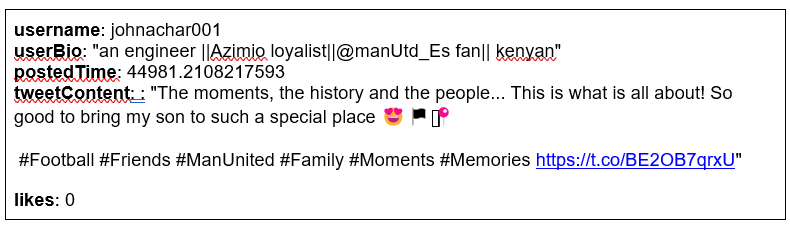
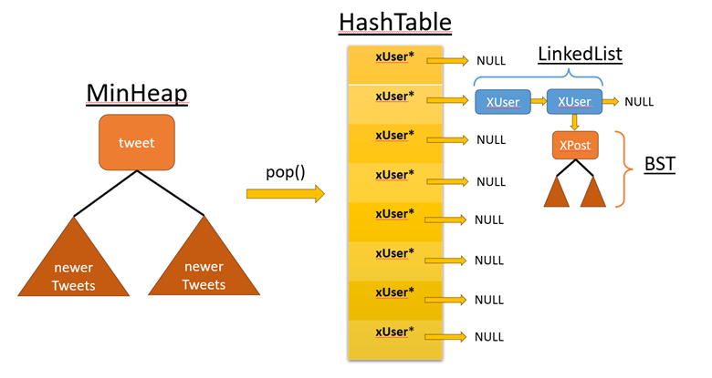

## Data Structures Used

1. Hashing to organize user data (XUser). Hashing is done by XUser's username.
2. Chaining with linked lists to manage collision in the hash table
3. Interfacing with minHeap for data input to ensure they are handled in historical order. The minHeap is sorted by Tweet Time.
4. Integration and nesting of multiple data structures including a BST organized by post time for each User Node to maintain individual tweets (XPost), allowing for efficient queries

## Instructions to run 
 1. Open up your Linux terminal, navigate to the main directory 
 2. Run the `make` command.
 3. If there are no compilation errors, an executable will be generated within the directory: `run_app`.
 5. 5o run your program, execute `run_app` from the terminal by typing `./run_app <twitter data csv filename>`.
 6. To test, select a menu option to validate behavior 

## Background 

This project involves creating and maintaining a new database system for the rebranded "X," formerly known as "Twitter." The goal is to transition from the previous single-structure tweet storage to a more efficient model using multiple data structures. This will enhance data handling and retrieval for users and Tweet data.

The goal is to create and maintain a new database of Twitter data, where you can interact with a struct representing tweets and reorganize the data into XUser and XPost structs containing the following:
1.	username: string identifying tweet author
2.	userBio: string containing user’s biography statement
3.	postedTime: time of tweet, represented by float variable encapsulating month/day/year and time information.
4.	tweetContent: body of tweet, string format
5.	likes: integer representing number of likes tweet received


Here is one example of a tweet


Which will be stored using the following structure (can be found at minHeap.hpp):
```
struct tweet {
	string username;
	string userBio;
	float postedTime; // key
	string tweetContent;
	int likes;
};
```

 ## Overview

 1: Build MinHeap - calls parseCV file to parse the Tweets into the minHeap. The file path is stored in argv[1].
 2: Build Linked List Hash Table - Checks if minHeap is empty. If not, pops each tweet from the heap and checks if its User is in the hash table. If not, insert the user. Then add the tweet to the user's BST.
 3: Add XUser - Queries for users username and bio, then creates a new XUser with those values and inserts it into the hash Table.
 4: Add Tweet By User - Queries for the Users username, checks if the user is in the hash table, and if it is, queries for the Tweet content, creates a new XPost structure and inserts it into the users BST.
 5: Display All Tweets - Checks if the minHeap is empty and if it isn't, prints each post in the minHeap and then checks if the minHeap is out of order.
 6: Display All Users - Prints all users in the Hash table.
 7: Display All Tweets By User - Queries for the user's username, and then prints all Tweets by that User.
 8: Display The Most Liked Tweet - Prints the most liked tweet from every tweet stored in each User's BST that is in the hash table.
 9: Performance Metrics - Displays the MinHeap's capacity and size, the number of collisions in the hash table, and the longest chain in the hash table.


###Implementation

## Data Structure Diagram


Note that as mentioned and depicted above, each node in the hash table (XUser) will have a BST associated with it. The BST pointer will simply be stored inside of the user node. This is an object pointer for an instance of a BST class storing XPost structs. The XUser and XPost structs can be seen below, representing the hash table and BST nodes respectively.

```
struct XUser {
	string username; 
	string userBio;
	int postCount;
	XUser* next;
	BST* bst;
};
```

```
struct XPost {
	int postedTime;
	string xContents;
	int likes;
	XPost* left;
	XPost* right;
};
```

 ## Hashing

Implemented in hash.cpp, with class definition and function declaration in hash.hpp

HashTable will have a dynamically allocated array pointer given as XUser* *table. Note, the array will store the heads of the linked list chains. Therefore each element of the array is of type XUser* and the other ‘*’ represents the fact that an array is created with a pointer (recall how with a pointer we created dynamic memory allocation for arrays).

The class of HashTable will also store a variable for numCollision to keep track of the number of collisions. Remember if two keys x and y are such that x!=y but hash(x)==hash(y) then it is a collision by definition. So, for example if you entered the username ‘iron_man’ and then you tried to insert a second ‘iron_man’ there is no collision. If you then inserted the user ‘bat_man’ and hash(iron_man) == hash(bat_man), now you have a collision. So the variable  numCollision should be adjusted accordingly. Beyond this any other insertion of ‘iron_man’ or  ‘bat_man’ will not change numCollision.

### unsigned int hashFunction(string key);

This function calculates the hash value for a given string. To calculate the hash value of a given string, sum up the ascii values of all the characters from the string. Then take the% operator with respect to tableSize. 

Return the hash table index for the key as an unsigned int (why unsigned?)
    
### XUser* insertUser(string username, string userBio);

This function takes in new user data via `username` and `userBio` strings and do the following:
1. Check if the username has already been added, return NULL if so 
Otherwise
2. Call `hashFunction()` with the `username` as key. 
3. Use the helper function `createUser()` if a new user is to be added, this should return an instance of a new XUser struct.
4. Handle collisions by inserting new XUser structs at head of linked list chain at desired index (Reminder: table[index] is the bucket containing the head pointer, follow your types!)
5. Keep track of collisions
6. Return pointer to new user node on success
    
### XUser* searchUser(string username);

This function takes in the `username` to be searched for in the hash table. Relies on hashFunction() to find the bucket and head of the linked list containing each XUser.

Return NULL if no user found.
    
### void printUsers();

This function takes no inputs and does not return any information. For every bucket in the table, print the contents of the chain in the following: 

```
1|ohio_cards-->StaticP7-->NULL
0|NULL
2|AGroupNews1-->DhakaTribune-->crazymukola-->joeybakes_-->NULL
```
    
### void printAllPostByUser(string username);

This function takes the `username` to be searched for in the hash table. If the user cannot be found, print the message `User does not exit, try again..."` and return with no other behavior. Otherwise, display the user's posts in the following format:

```
himalaya_times:
| userBio: Official Twitter handle of Himalaya Times National Daily, Nepal's leading newspaper and https://t.co/JqQXlkowOP
 For english News : https://t.co/JHcxSxp99S
| postCount: 1
| Posts:
1559027840:
---> डि मारियाको ह्याट्रिकमा युभेन्ट्सको सहज जित
 #dmariya #uvents #khel #sports #football #HimalayaTimes #Hita #Himalaya_Times #nepalihimalayatimes #News #Dailynewspaper #nepalinewspaper #Himalaya
 https://t.co/HhWyuITmZ9
```

Note that the `printAllPostByUser()` function must print the `XUser` information, but should call the BST class' `displayPosts()` function.


### void printMostLikedPost();

This function should traverse the entire hash table and, for each user, compare the likes on each post to find the globally most popular tweet/post. If there is a tie for highest likes, just keep the first one found ('>' vs '>='). Once found, print in the following format:

```
Most liked post by: CoachJoeyG
| userBio: Head Strength and Conditioning Coach FAU
| postCount: 2
| Post:
684143488:
__| likes: 778
__| Conditioning using small sided games and contact prep. Wondering about volume bc we are not running given distances like 100, are skill guys averaged 5k total yardage.
 #football #strengthandconditioning #workout https://t.co/cm4NGQ0JN1
```

### int longestChain();

This function traverses each chain and returns the length of the longest

## bst.cpp functions:

### void insertPost(float time, string content, int likes);

This function takes in the posted time as a float, tweet/post content as a string, and an integer for likes. This is a standard bst insertion, using time as the key.

This function relies on the `createPost()` and `insertHelper()` functions.

### XPost* insertHelper(XPost* rt, XPost* pst);

This function is the recursive helper for insertPost. `rt` is the root of the subtree where insertion is happening, `pst` is the new post to be inserted. If `rt` is NULL, return `pst`, otherwise recurse and eventually return `rt`. 

### void displayPosts();

This function calls `displayHelper()`

### void displayHelper(XPost* rt);

This function is recursive and therefore takes the root (`rt`) of the subtree to be printed in IN_ORDER fashion, i.e) recurse left, print `rt`, recurse right. 

### XPost* mostPopular();

This function returns the most liked post in the BST by calling the `mostPopularHelper()` with an `XPost*` variable that will also serve as the return variable

### void mostPopularHelper(XPost* rt, XPost*& mostLiked);

This function takes the root of the tree initially and subtree on subsequent recursive calls. The most liked post is always passed along. Once a post with a higher like count is found, set mostLiked and continue searching.

